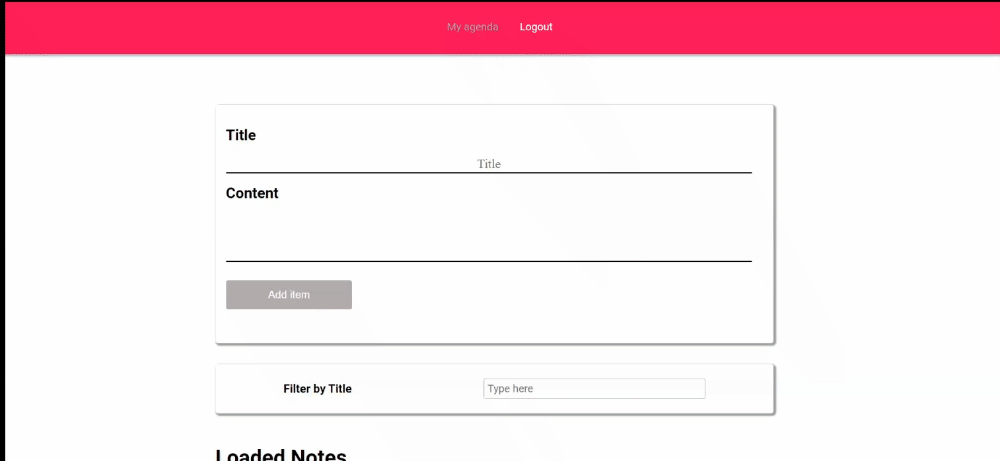

# React-Agenda
> Job site developed as a study where you create tickets to your daily routine.

## Project Agenda
This project is a  website, totally responsive,where you can create tickets to your daily routine.

## About this project
I developed this site as a challenge, to put my knowledge in Reactjs and logic into practice.

### What can you do ?
- You can create your ticket.
- You can search for your ticket.
- You can create an account and log in to the website.
- You can delete your ticket. 

### How is the site?
  #### Index page:
   
   
### Stack 
1. ReactJS - as FrontEnd
2. Redux - as library to manage auth state
3. Axios - as library to manage HTTP request
4. React-Router-Dom - as library to manage routes
5. FireBase - as server side
6. FireBase - as cloud platform
7. FireBase - as Data base

## Want to say something?
If you have any question, suggestion or something, please feel free to open an issue. I'll be happy to answer it! :)

## Link
[Agenda](https://react-my-agenda-3037a.web.app/)
